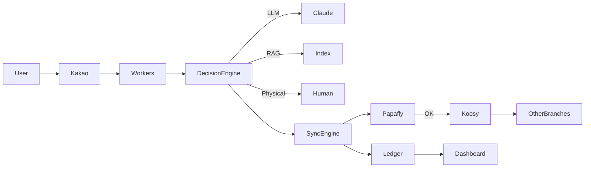

# DTSLIB HQ OS WHITEPAPER v3.0

> "주고 싶어도 못 주는 공장" — AI 시대의 프랜차이즈 운영체제

---

## PART 1 / 4
(1) Vision & Philosophy → (4) Multi-Repo Strategy

---

## 1. Vision & Philosophy

DTSLIB HQ는 "가르치는 곳"이 아니다.
HQ는 **작동하는 판(Factory)**이다.

우리가 파는 것은 지식이 아니라 **재현 가능한 시스템**이다.
"AI로 1인 사업자를 만든다"는 문장은 슬로건이 아니라,
운영체제(OS)의 목적 함수다.

이 시스템의 핵심 공리는 하나다.

> **주고 싶어도 전부 줄 수 없다.**
> 그래서 "본사"가 필요하다.

- 모든 노하우를 말로 전달하려 하면 실패한다.
- 복제 가능한 것은 "설명"이 아니라 "구조"다.
- 프랜차이즈의 본질은 교육이 아니라 **통제된 복제**다.

DTSLIB HQ는 이 원리를 코드로 구현한다.

- 사람 대신 **정책(Policy)**이 판단한다.
- 기억 대신 **원장(Ledger)**이 남는다.
- 감각 대신 **결정모드(Decision Mode)**가 작동한다.
- 대화 대신 **PR과 배포**가 흐른다.

HQ는 "중앙 통제 시스템(Control Plane)"이고,
각 브랜치는 "독립 사업 유닛(Cell)"이다.

이 구조에서:
- **HQ**는 권력과 규칙을 가진다.
- **Branch**는 수익과 책임을 가진다.
- **AI**는 노동자다.
- **인간**은 최종 심급(Final Court)이다.

---

## 2. HQ OS란 무엇인가

DTSLIB HQ OS는 다음 세 층으로 구성된다.

```
┌─────────────────────────────┐
│        Control Plane        │
│  (Policy, Decision Engine)  │
├─────────────────────────────┤
│        Data Plane           │
│   (Ledger, Registry, Sync)  │
├─────────────────────────────┤
│       Execution Plane       │
│ (Workers, LLM, GitHub API)  │
└─────────────────────────────┘
```

### 2.1 Control Plane
- `policy.json` : 무엇이 허용되는가
- `decision-engine.json` : 누가 판단하는가 (Physical / RAG / LLM / Ontology)
- `killSwitch` : 전면 정지 버튼

### 2.2 Data Plane
- `branches.json` : 모든 Cell의 등기부
- `ledger.jsonl` : 모든 사건의 원장 (append-only)
- `sync-plan.json` : 배포 전략

### 2.3 Execution Plane
- Cloudflare Workers (Router)
- GitHub Actions (Orchestrator)
- LLM (Claude/GPT)
- Branch Repos (사업 현장)

**HQ는 "서버"가 아니라 법원 + 관제센터 + 공장의 합성체다.**

---

## 3. Branch = Cell 모델

Branch는 Git 브랜치가 아니다.
Branch는 **사업 유닛(Cell)**이다.

각 Cell은:
- 독립 도메인
- 독립 수익 구조
- 독립 콘텐츠
- 독립 실패 가능성

을 가진다.

### 3.1 Cell의 필수 속성

```json
{
  "id": "papafly",
  "repo": "dtslib1979/papafly",
  "domain": "papafly.dtslib.com",
  "visibility": "incubation",
  "hqProtocolVersion": "2.1",
  "tier": "canary",
  "owner": "dimas",
  "maintenanceMode": false
}
```

Cell은 "사이트"가 아니라 **미니 회사**다.

- `tier: canary` → 테스트 점포
- `tier: standard` → 주력 점포
- `tier: incubation` → 신규 가맹점

HQ는 이 티어를 기준으로 배포 순서를 통제한다.

---

## 4. Multi-Repo Strategy

DTSLIB는 **Monorepo를 쓰지 않는다.**

왜냐하면 우리는 "코드"를 관리하는 게 아니라
**사업체를 관리**하기 때문이다.

| 전략 | 장점 | 단점 | DTSLIB 적합성 |
|------|------|------|---------------|
| Monorepo | 단일 진실 원천 | 권한 분산 불가 | ❌ |
| Multi-Repo | 독립성, 확장성 | 동기화 비용 | ✅ |

### 4.1 멀티레포의 의미

- 각 Cell은 자기 레포를 가진다.
- HQ는 중앙 통제 레포다.
- HQ → Branch는 항상 **PR로만** 전파된다.
- Branch는 HQ를 "의견 제시자"로 대한다.
- HQ는 Branch를 "사업 주체"로 존중한다.

이 구조는 다음을 가능하게 한다.

1. **한 Cell이 망해도 전체가 죽지 않는다.** (Blast Radius 분리)
2. **각 Cell에 다른 권한을 줄 수 있다.**
3. **배포 주기를 분리할 수 있다.**
4. **수익과 비용을 분리할 수 있다.**

즉, **프랜차이즈 구조가 코드로 구현된다.**

---

## PART 2 / 4
(5) Decision Modes → (8) Sync Engine & Canary Deploy

---

## 5. Decision Modes

HQ의 모든 판단은 "누가 결정하는가"에 따라 네 가지 모드로 나뉜다.

```json
// hq/registry/decision-engine.json
{
  "killSwitch": false,
  "modes": {
    "physical": { "priority": 1, "requiresHuman": true },
    "rag": { "priority": 2, "source": "hq-knowledge-base" },
    "llm": { "priority": 3, "model": "claude" },
    "ontology": { "priority": 4, "ruleset": "ontology-schema.json" }
  },
  "fallbackChain": ["ontology", "llm", "rag", "physical"]
}
```

### 5.1 모드 정의

| Mode | 의미 | 사용 예 |
|------|------|---------|
| Physical | 인간 판단 | 법적, 계약, 금전 |
| RAG | 내부 문서 기반 | 정책 해석 |
| LLM | 창작/요약 | 콘텐츠 생성 |
| Ontology | 규칙 엔진 | 형식 검증 |

### 5.2 작동 원리

1. 요청 수신
2. killSwitch 확인
3. 정책 매칭
4. Decision Mode 선택
5. 실패 시 fallbackChain 순환
6. Physical까지 도달하면 사람에게 이관

이 구조는 **AI가 "판사"가 되는 것을 방지**한다.
AI는 노동자다. 최종 책임은 인간이다.

---

## 6. Governance Layer

Governance는 "누가 무엇을 할 수 있는가"를 코드로 정의한다.

```json
// hq/registry/policy.json
{
  "rules": [
    {
      "id": "no-direct-push",
      "description": "HQ는 Branch에 직접 push할 수 없다",
      "enforcement": "reject"
    },
    {
      "id": "canary-first",
      "description": "모든 배포는 canary tier부터",
      "enforcement": "block"
    },
    {
      "id": "ledger-mandatory",
      "description": "모든 작업은 ledger 기록 필수",
      "enforcement": "abort"
    }
  ]
}
```

### 6.1 RWD Matrix

| Role | Registry | Ledger | Sync | Policy |
|------|----------|--------|------|--------|
| HQ Admin | R/W | R/W | R/W | R/W |
| Branch Owner | R | R | R | - |
| LLM | R | W | - | - |
| Worker | R | W | W | - |

### 6.2 위반 시 처리

- CI 단계에서 정책 위반 → PR Reject
- 반복 위반 → Branch Lock
- 중대 위반 → HQ Admin Escalation

**Governance는 "문서"가 아니라 집행되는 법이다.**

---

## 7. Ledger & Audit Trail

Ledger는 DTSLIB의 심장이다.

- Append-only
- 삭제 불가
- 모든 사건 기록

```jsonl
// hq/ledger/ledger.jsonl (sample)
{"id":"TXN-20260116-001","branch":"papafly","event":"deploy","status":"success","tokens":1450,"cost":0.031,"actor":"llm","timestamp":"2026-01-16T10:12:00Z"}
{"id":"TXN-20260116-002","branch":"koosy","event":"pr_opened","status":"pending","actor":"worker","timestamp":"2026-01-16T10:14:00Z"}
```

### 7.1 원칙

1. **기록되지 않은 변경은 불법이다.**
2. **비용은 반드시 귀속된다.**
3. **Ledger는 단일 진실 원천이다.**

### 7.2 활용

- 감사(Audit)
- 비용 정산(Billing)
- 장애 분석
- 운영 지표

**Ledger는 "로그"가 아니라 회계 장부다.**

---

## 8. Sync Engine & Canary Deploy

Sync Engine은 HQ의 "팔"이다.

```json
// hq/sync/sync-plan.json
{
  "strategy": "canary",
  "tiers": ["canary", "standard", "incubation"],
  "order": ["papafly", "koosy", "*"],
  "onFailure": "halt",
  "maxRetries": 3
}
```

### 8.1 배포 흐름

```
HQ 변경
   │
   ▼
Papafly (Canary)
   │ 성공
   ▼
Koosy (Standard)
   │ 성공
   ▼
Others (Incubation)
```

실패 시:
1. 즉시 중단
2. 자동 롤백
3. Ledger 기록
4. 알림 발송
5. Escalation 판단

### 8.2 충돌 처리

```json
// hq/sync/conflict-policy.json
{
  "priority": "cell",
  "onConflict": {
    "label": "conflict",
    "notify": "cell_owner",
    "timeoutHours": 72,
    "escalateTo": "hq_admin"
  }
}
```

**Branch 수정이 우선이다.**
HQ는 "폭군"이 아니라 "본사"다.

---

## PART 3 / 4
(9) Cost Attribution → (12) Disaster Recovery

---

## 9. Cost Attribution & Billing

프랜차이즈는 "같이 쓰는 시스템"이 아니라
**"각자 비용을 지불하는 사업 유닛"**이다.

HQ는 모든 API 키를 중앙에서 관리하지만,
비용은 반드시 Branch 단위로 귀속되어야 한다.

```json
// hq/billing/cost-policy.json
{
  "tiers": {
    "incubation": { "monthlyTokenLimit": 200000, "rate": 0.00002 },
    "standard": { "monthlyTokenLimit": 1000000, "rate": 0.000018 },
    "premium": { "monthlyTokenLimit": 5000000, "rate": 0.000015 }
  }
}
```

Ledger는 반드시 다음 필드를 포함해야 한다:

```json
{
  "id": "TXN-20260118-014",
  "branch": "koosy",
  "event": "llm_generate",
  "tokens": 1520,
  "cost": 0.02736,
  "tier": "standard",
  "actor": "llm",
  "timestamp": "2026-01-18T02:11:44Z"
}
```

### 9.1 월간 정산 파이프라인

```yaml
# .github/workflows/hq-billing-aggregate.yml
name: Monthly Billing
on:
  schedule:
    - cron: "0 0 1 * *"
jobs:
  aggregate:
    runs-on: ubuntu-latest
    steps:
      - uses: actions/checkout@v4
      - run: node scripts/aggregate-ledger.js
      - run: node scripts/generate-invoice.js
```

결과물:
```
billing/
  2026-01/
    koosy.json
    papafly.json
    summary.csv
```

이 시스템이 있어야 HQ는 "교육자"가 아니라
**운영사(Operator)**가 된다.

---

## 10. Dashboard & Observability

Dashboard는 "보는 화면"이 아니라
**HQ의 신경계**다.

최소 구성:

| 위젯 | 의미 |
|------|------|
| Branch Health | 각 Cell 상태 |
| Ledger Flow | 최근 24h 이벤트 |
| Cost Meter | 브랜치별 비용 |

```html
<!-- hq/dashboard/index.html (MVP) -->
<div id="health"></div>
<div id="ledger-stream"></div>
<div id="cost-meter"></div>
```

```javascript
// hq/dashboard/app.js
fetch('/api/health').then(renderHealth);
fetch('/api/ledger?last=100').then(renderLedger);
fetch('/api/cost').then(renderCost);
```

### 10.1 관찰성 원칙

1. **모든 실패는 시각화된다**
2. **모든 비용은 실시간으로 보인다**
3. **"왜 느려졌는가?"를 추적할 수 있어야 한다**

Ledger + Workers Metrics + GitHub Insights
→ HQ는 눈을 가진 시스템이 된다.

---

## 11. Disaster Recovery

프랜차이즈 본사는 **"망하면 안 되는 존재"**다.

```json
// hq/recovery/backup-policy.json
{
  "ledger": { "daily": true, "target": "r2://hq-backup" },
  "registry": { "strategy": "git-tag", "interval": "weekly" },
  "workers": { "fallback": "static-maintenance-page" }
}
```

```markdown
<!-- hq/recovery/rollback-playbook.md -->
# Rollback Playbook

1. Identify failing TXN in ledger
2. Determine affected branch set
3. Execute hq-sync --rollback --target=TXN-ID
4. Verify via health-check.json
5. Notify all stakeholders
```

```json
// hq/recovery/health-check.json
{
  "endpoints": [
    "https://koosy.dtslib.com/health",
    "https://papafly.dtslib.com/health"
  ],
  "interval": "5m",
  "onFailure": ["notify", "rollback"]
}
```

원칙:
- Ledger는 매일 백업된다
- Registry는 Git 태그로 스냅샷
- Workers 장애 시 자동 Maintenance Mode

**HQ는 죽지 않는 시스템이어야 한다.**

---

## 12. Escalation Matrix

AI는 판단할 수 없는 순간이 반드시 온다.
그때 **"누가 책임지는가"**가 명확해야 한다.

| 상황 | Level 1 | Level 2 | Level 3 |
|------|---------|---------|---------|
| LLM 실패 | RAG | Physical | HQ Admin |
| 배포 실패 | Retry | Rollback | Branch Lock |
| Ledger 오류 | Auto-Check | Restore | Manual Audit |
| 비용 초과 | Throttle | Notify | Suspend |

```json
// hq/registry/decision-engine.json (extended)
{
  "killSwitch": false,
  "maintenanceMode": {},
  "escalation": {
    "deployFailure": ["retry", "rollback", "hq_admin"],
    "llmError": ["rag", "physical", "hq_admin"]
  }
}
```

이 구조는
**"AI는 실무자, 인간은 책임자"**라는 원칙을
코드로 고정한다.

---

## PART 4 / 4
(13) Notification → (16) Operational Constitution + Appendices

---

## 13. Notification System

HQ는 "조용히 망하는 시스템"이 되면 안 된다.
모든 이상은 사람에게 도달해야 한다.

```
hq/
  notifications/
    channels.json
    rules.json
```

```json
// hq/notifications/channels.json
{
  "kakao": {
    "hq": "https://kakao.webhook/hq",
    "koosy": "https://kakao.webhook/koosy"
  },
  "slack": {
    "critical": "https://slack.webhook/hq-critical",
    "ops": "https://slack.webhook/hq-ops"
  }
}
```

```json
// hq/notifications/rules.json
{
  "deploy_failed": ["slack:critical", "kakao:hq"],
  "conflict_detected": ["kakao:branch_owner"],
  "ledger_error": ["slack:critical"],
  "cost_limit_exceeded": ["kakao:branch_owner", "slack:ops"],
  "kill_switch_activated": ["slack:critical", "kakao:hq"]
}
```

Workers는 모든 이벤트를 `eventType`으로 표준화하여
Notification Router로 전달한다.

```javascript
emit("deploy_failed", { branch: "koosy", txn: "TXN-..." });
```

**HQ는 더 이상 "기다리는 본사"가 아니다.**
먼저 울리는 경보기가 된다.

---

## 14. Versioning & Migration

Branch는 시간이 지나면 서로 다른 "시대"에 머문다.
HQ는 이를 방치하지 않는다.

```json
// hq/registry/branches.json
{
  "hqVersion": "2.1",
  "migration": {
    "from": "2.0",
    "script": "migrations/v2-to-v21.js",
    "deprecateAfterDays": 7
  },
  "branches": [
    {
      "id": "koosy",
      "repo": "github.com/dtslib/koosy",
      "domain": "koosy.dtslib.com",
      "visibility": "public",
      "hqProtocolVersion": "2.0",
      "tier": "standard"
    }
  ]
}
```

### 규칙

1. **메이저 버전 변경 → 마이그레이션 스크립트 필수**
2. **구버전 Branch는:**
   - 경고 상태로 전환
   - HQ 명령 일부 제한
3. **7일 유예 후:**
   - 자동 Migration PR 생성
   - 미적용 시 "Maintenance Mode" 진입

**HQ는 시간을 관리하는 시스템이다.**

---

## 15. Operational Constitution

**(DTSLIB HQ 헌법)**

이 시스템은 기술이 아니라 **질서**다.

> ### DTSLIB HQ Operational Constitution
>
> **Article 1 — Safety First**
> 모든 변경은 Papafly(Cell Zero)에서 검증된 후에만
> 다른 Branch로 전파된다.
> *(Canary Deploy is mandatory.)*
>
> **Article 2 — Audit is Law**
> 기록되지 않은 변경은 불법이다.
> 모든 행동, 모든 비용, 모든 실패는 Ledger에 남는다.
>
> **Article 3 — Central Control**
> HQ Policy를 위반하는 PR은
> 인간의 판단 이전에 시스템에 의해 거부된다.
>
> **Article 4 — Human in the Loop**
> AI는 실행자이며,
> 최종 책임은 항상 인간에게 있다.
>
> **Article 5 — Cost is Reality**
> 모든 Branch는 자신의 비용을 지불한다.
> 프랜차이즈는 "같이 쓰는 꿈"이 아니라
> "각자 감당하는 사업"이다.

이 헌법이
**교육을 공장으로 바꾸는 규칙**이다.

---

## Appendix A — JSON Schema Examples

```json
// hq/registry/schemas/branch.schema.json
{
  "$schema": "http://json-schema.org/draft-07/schema#",
  "type": "object",
  "required": ["id", "repo", "domain", "visibility"],
  "properties": {
    "id": { "type": "string", "pattern": "^[a-z0-9-]+$" },
    "repo": { "type": "string" },
    "domain": { "type": "string", "format": "hostname" },
    "visibility": { "enum": ["public", "private", "incubation"] },
    "hqProtocolVersion": { "type": "string" },
    "tier": { "enum": ["incubation", "standard", "premium"] }
  }
}
```

```json
// hq/ledger/schemas/ledger-entry.schema.json
{
  "type": "object",
  "required": ["id", "branch", "event", "timestamp"],
  "properties": {
    "id": { "type": "string" },
    "branch": { "type": "string" },
    "event": { "type": "string" },
    "tokens": { "type": "number" },
    "cost": { "type": "number" },
    "actor": { "type": "string" },
    "timestamp": { "type": "string", "format": "date-time" }
  }
}
```

---

## Appendix B — Sample Ledger Entries

```jsonl
{"id":"TXN-20260118-001","branch":"papafly","event":"deploy_test","actor":"hq","timestamp":"2026-01-18T01:02:03Z"}
{"id":"TXN-20260118-002","branch":"koosy","event":"llm_generate","tokens":1840,"cost":0.033,"actor":"llm","timestamp":"2026-01-18T01:04:10Z"}
{"id":"TXN-20260118-003","branch":"koosy","event":"deploy_failed","actor":"ci","timestamp":"2026-01-18T01:05:44Z"}
```

---

## Appendix C — HQ Flow Diagram



---

## 최종 선언

이 문서는 "설명서"가 아니다.
**운영체제의 헌법**이다.

- 교육은 실패한다.
- 시스템은 반복된다.
- 인간은 흔들린다.
- **공장은 흔들리지 않는다.**

DTSLIB HQ OS는
사람을 바꾸려 하지 않는다.
대신,
**사람이 바뀐 것처럼 행동하게 만드는 판**을 만든다.

---

*Version: 3.0*
*Date: 2026-01-16*
*Author: DTSLIB HQ*
